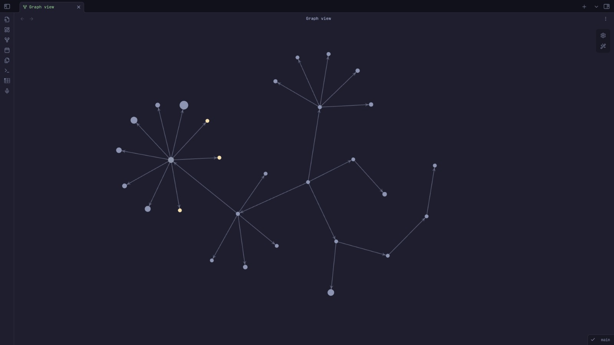
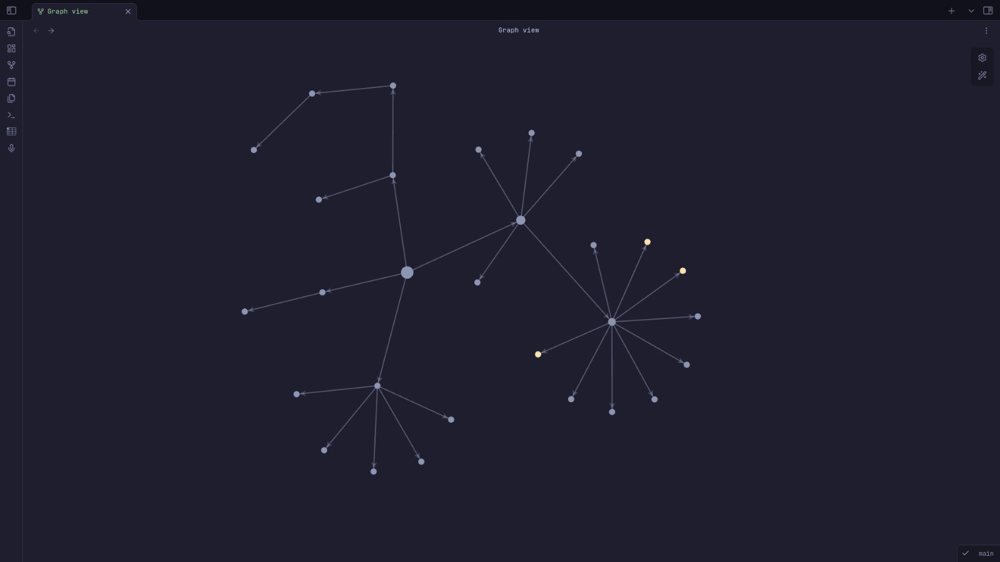

# Node Factor
This plugin helps you customize the factors that effect node size in obsidian graph view.
The factors include, letter count, forward & backward weight, and forward tree weight.

## Installation
1. Search for "Node Factor" in Obsidian's community plugin browser.
2. Install it.
3. Enable the plugin in your Obsidian settings under "Community plugins".
## Configuration Options
| Option                          | Meaning																									| Default value |
| ------------------------------- | ------------------------------------------------------------------------------------------------------- | ------------- |
| Forward link weight multiplier  | Weight of single link coming out of a node																| 1             |
| Travel forward tree             | Determines if forward weight is decided by just the immediate nodes coming out or everything after it	| off           |
| Backward link weight multiplier | Weight of single link coming out of a node																| 1             |
| Character per weight            | Given number of letters give 1 weight																	| 0             |
## Author
CalfMoon: [Email](kritagyabhattarai@proton.me), [Github](https://github.com/CalfMoon)
## Bug Reports
This project still new and might have a few bugs. For bug reports use this repo's Issues section.
## License
MIT, see [LICENSE](LICENSE).
